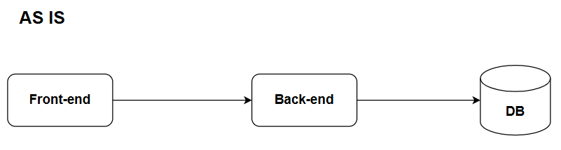
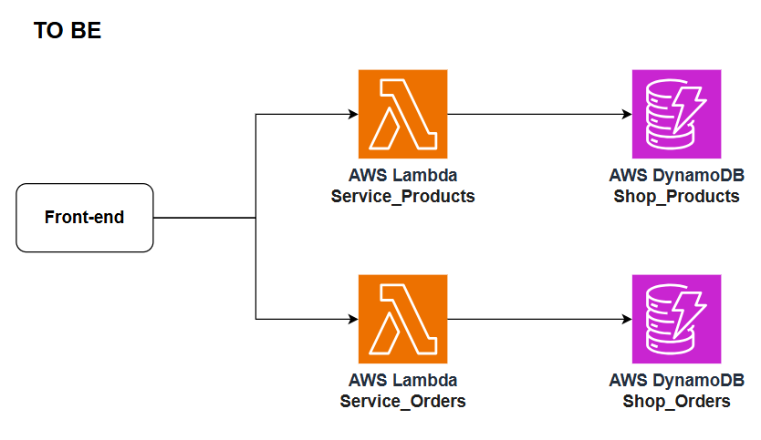

# MOD3-LAB1: Descomposición por Dominio en AWS
**Instructor:** Miguel Leyva

---

## 1. Objetivo, alcance

**Objetivo**
Implementar una arquitectura de backend desacoplada utilizando Domain-Driven Design (DDD).

**Qué aprenderá el alumno**
* Utilizar tablas independientes de DynamoDB AWS para aislar datos.
* Desarrollar funciones AWS Lambda con lógica de negocio específica (Python 3.x).
* Gestionar roles de IAM para permitir que el cómputo acceda a los datos.
* Entender la diferencia crítica entre "Capas Técnicas" y "Límites de Dominio".

---

## 2. Prerrequisitos y herramientas
* Tener activa una cuenta de AWS.
* Contar con los permisos para gestionar Lambdas, DynamoDB, IAM.
* Usar la región `us-east-1` (Virginia).
* Conocimientos: Lectura básica de JSON y Python.
* Tener instalado Visual Studio Code, Postman y DrawIO.

---

## 3. El problema
ShopCloud tiene una aplicación monolítica. Cuando lanzan una oferta de Black Friday, el módulo de "Ventas" satura la base de datos central. Esto provoca que el módulo de "Inventario" deje de funcionar, paralizando la logística aunque el problema sea solo de ventas web. 



---

## 4. Solución
Aplicaremos Descomposición por Dominio. Dividiremos el sistema en dos microservicios autónomos:
* **Dominio de Inventario**: Gestiona productos. Tiene su propia base de datos.
* **Dominio de Ventas**: Gestiona órdenes de compra. Tiene su propia base de datos.

Si "Ventas" cae o se satura, "Inventario" sigue operando al 100%.


---

## 5. Laboratorio guiado

### FASE 1: La Capa de Datos (DynamoDB)

**Paso 1: Crear la Tabla de Productos**
1. Inicia sesión en la Consola de AWS.
2. En la barra de búsqueda superior, escribe **DynamoDB** y seleccionalo.
3. En el menú lateral izquierdo, haz clic en **Tables**.
4. Haz clic en el botón **Create table**.
5. Completa los campos exactamente así:
   * **Table name:** `Shop_Products`
   * **Partition key:** `productId` (Selecciona tipo: String)
6. En “Table settings”, deja seleccionado **Default settings**.
7. Haz clic en el botón **Create table** al final de la página.

**Paso 2: Crear la Tabla de Ordenes**
1. Haz clic nuevamente en **Create table**.
2. Completa los campos:
   * **Table name:** `Shop_Orders`
   * **Partition key:** `orderId` (Selecciona tipo: String)
3. Deja los demás valores por defecto y haz clic en **Create table**.

### FASE 2: La Lógica de Negocio (AWS Lambda)

**Paso 3: Crear la Función de Inventario (Products)**
1. En la barra de búsqueda superior, escribe **Lambda** y seleccionalo.
2. Haz clic en el botón **Create function**.
3. Selecciona la opción **Author from scratch**.
4. Completa los campos:
   * **Function name:** `Service_Products`
   * **Runtime:** Selecciona Python 3.14 (o superior).
   * **Architecture:** x86_64.
5. Haz clic en **Create function**.

**Paso 4: Configurar Permisos (IAM) para Products**
1. En la pantalla de tu función `Service_Products`, ve a la pestaña **Configuration**.
2. En el menú lateral izquierdo, haz clic en **Permissions**.
3. Haz clic en el enlace azul bajo **Role name** para abrir IAM en una nueva pestaña.
4. En IAM, haz clic en **Add permissions** -> **Attach policies**.
5. Busca: `AmazonDynamoDBFullAccess` *(Nota: En producción se usaría el mínimo privilegio)*.
6. Marca la casilla y haz clic en **Add permissions**.
7. Cierra la pestaña de IAM.

**Paso 5: Programar el Lambda de Productos**
1. Ve a la pestaña **Code** en tu Lambda.
2. Abre `lambda_function.py` y pega el siguiente código.

```python
import json
import boto3
from decimal import Decimal

# Inicializamos la conexión a la base de datos específica de este dominio
dynamodb = boto3.resource('dynamodb')
table = dynamodb.Table('Shop_Products')

def lambda_handler(event, context):

    print("Procesando un registro de Producto:")
    
    # Guardamos el producto
    body = event.get('body', {})
    if isinstance(body, str):
        body = json.loads(body)
        
    item = {
        'productId': body['id'],
        'name': body['name'],
        'price': Decimal(str(body['price'])),
        'stock': body['stock'] 
    }
    
    # Metodo put_item agrega o reemplaza un elemento
    table.put_item(Item=item)

    return {
        'statusCode': 200, 
        'body': json.dumps('Producto creado exitosamente')
    }
```

3. Haz clic en **Deploy**.

**Paso 6: Crear la Función de Ordenes (Sales)**
1. Vuelve al listado de funciones Lambda y haz clic en **Create function**.
2. **Function name:** `Service_Orders` (Runtime: Python 3.14).
3. Haz clic en **Create function**.

**Paso 7: Configurar Permisos para Orders**
1. Repite los pasos de IAM para asignar `AmazonDynamoDBFullAccess` al rol de esta nueva función.

**Paso 8: Programar el Lambda de Órdenes**
1. Pega el siguiente código en la pestaña **Code**.

```python
import json
import boto3
import uuid
import datetime

# Inicializamos la conexión a la base de datos específica de este dominio
dynamodb = boto3.resource('dynamodb')
table = dynamodb.Table('Shop_Orders')

def lambda_handler(event, context):

    print("Procesando nueva orden...")
    
    body = event.get('body', {})
    if isinstance(body, str):
        body = json.loads(body)
    
    # Generamos un ID único para la orden
    order_id = str(uuid.uuid4())
    
    # Guardamos la orden
    item = {
        'orderId': order_id,
        'productId': body.get('productId'),
        'quantity': body.get('quantity'),
        'status': 'CONFIRMED',
        'timestamp': str(datetime.datetime.now())
    }
    
    table.put_item(Item=item)
    
    return {
        'statusCode': 200, 
        'body': json.dumps({
            'message': 'Orden procesada correctamente', 
            'orderId': order_id,
            'status': 'CONFIRMED'
        })
    }
```

2. Haz clic en **Deploy**.

---

## 6. Pruebas y validación

**Prueba A: Registrar un producto**
1. En `Service_Products`, ve a la pestaña **Test** -> **Create new event**.
2. **Event name:** `RegistrarLaptop`.
3. Pega el JSON de prueba, haz clic **Save** luego en **Test**.
```javascript
{
  "httpMethod": "POST",
  "body": {
    "id": "PROD-001",
    "name": "Laptop Gamer UTEC",
    "price": 1500.99,
    "stock": 100
  }
}
```

**Prueba B: Verificar el registro del producto**
1. Ve a **DynamoDB** -> **Tables** -> `Shop_Products` -> **Explore table items**.
2. Verifica que el producto aparece registrado.

**Prueba C: Registrar una venta desde Postman**
1. En `Service_Orders`, ve a **Configuration** -> **Function URL** -> **Create function URL** (Auth type: NONE) luego en **Save**.
2. Copia la URL, abre Postman y haz un request **POST**.
3. En el Body (Raw -> JSON), pega el JSON de prueba y envía la petición.
```javascript
{
  "body": {
    "productId": "PROD-001",
    "quantity": 2
  }
}
```
---

## 7. Laboratorio propuesto

La empresa ha decidido implementar un módulo de fidelización. Necesitan gestionar la información de los Clientes (Nombre, Correo, Categoría [VIP, No VIP]). 

Implementa el tercer dominio: **"Clientes"** siguiendo estrictamente el patrón arquitectónico establecido (DDD), evitando mezclar datos de clientes en la tabla de órdenes.

**Checklist:**
-  Crear la persistencia aislada para clientes (`Shop_Customers` con Partition Key: `customerId`).
-  Crear el microservicio de lógica (`Service_Customers`) en Python.
-  Asignar permisos de DynamoDB al rol del nuevo Lambda.
-  Registrar un cliente de prueba desde Postman apuntando a la URL del Lambda.
-  Actualizar diagrama de arquitectura To Be.

> **Nota:** Al finalizar debes tener 3 tablas DynamoDB activas y 3 funciones Lambda, totalmente independientes entre sí.

---

## 8. Limpieza de recursos
Para evitar consumos inesperados en AWS, asegúrate de eliminar los recursos:

1. **DynamoDB:** Elimina las tablas `Shop_Products`, `Shop_Orders` y `Shop_Customers`.
2. **Lambda:** Elimina las funciones `Service_Products`, `Service_Orders` y `Service_Customers`.
3. **IAM (Opcional):** Elimina los roles asociados a las Lambdas `Service_Products-role-xxxx` y `Service_Orders-role-xxxx` , `Service_Customers-role-xxxx`.