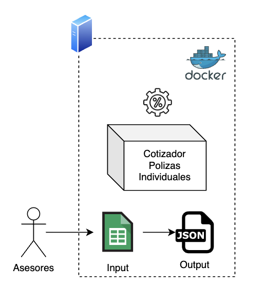
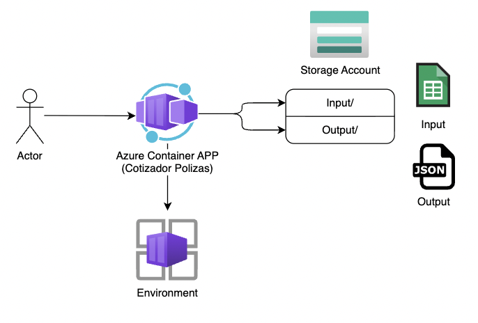

# MOD3-LABN1: Lab 02 — De Docker Compose On-Premise a CaaS en Azure
**Instructor:** Miguel Leyva

---

## 1. Objetivo, alcance

**Objetivo**
Migrar un servicio de cotización de seguros individuales que corre con Docker Compose en un servidor local hacia **Azure Container Apps**, cambiando únicamente la configuración de almacenamiento, sin modificar la lógica de negocio.

**Qué aprenderá el alumno**
* Comprender la diferencia entre ejecutar contenedores localmente y en la nube.
* Utilizar Azure Container Registry (ACR) para almacenar imágenes de contenedores.
* Desplegar aplicaciones en Azure Container Apps utilizando variables de entorno y secretos.
* Integrar Azure Blob Storage con aplicaciones en contenedores en lugar de usar el sistema de archivos local.

---

## 2. Prerrequisitos y herramientas

* Tener instalado Docker 24+
* Tener instalado Docker Compose v2
* Tener instalado Azure CLI 2.55+
* Cuenta activa de Azure con permisos para crear recursos.

---

## 3. El problema

La empresa de seguros **SegurosPro** tiene un cotizador de pólizas individuales que corre en un servidor físico de oficina con Docker Compose. El servicio lee un archivo CSV con las solicitudes de planes de seguro por cliente, calcula las primas mensuales y guarda el resultado en una carpeta local.

**El problema:** si el servidor se apaga, los asesores no pueden generar cotizaciones. No hay acceso remoto fácil, la infraestructura no es tolerante a fallos y no permite un escalado automático frente a campañas de ventas donde incrementa la demanda.



---

## 4. La Solución

Mover el contenedor a Azure sin reescribir el código base de la lógica de negocio, haciendo uso de los servicios en la nube para mejorar la disponibilidad y escalabilidad.

| Componente | On-Premise | Azure |
|---|---|---|
| Ejecución | Docker Compose | Azure Container Apps |
| Almacenamiento entrada (CSV) | Carpeta local `/input` | Azure Blob Storage → contenedor `input` |
| Almacenamiento salida (JSON) | Carpeta local `/output` | Azure Blob Storage → contenedor `output` |



### Estructura del Proyecto

```text
app/
├── app.py                  ← API Flask (lógica de negocio)
├── storage.py              ← Abstracción LOCAL / AZURE_BLOB
├── requirements.txt
├── Dockerfile
├── docker-compose.yml      ← Configuración on-premise
└── input/
    └── solicitud.csv       ← Archivo de prueba
```

---

## 5. Laboratorio guiado

### FASE 1: Construir el Sistema Local

**Paso 1 - Validar y Loguear con Azure**

```bash
docker --version
docker compose version
az --version
az login
```

**Paso 2 — Crear la carpeta del proyecto**

```bash
mkdir app && cd app 

mkdir input output 
```

**Paso 2 — `storage.py` (la capa que cambia entre local y Azure)**
Crea un archivo llamado `storage.py` con el siguiente código:

```python
# storage.py
import os
import logging

# Configuración básica de logging para el módulo
logger = logging.getLogger(__name__)

BACKEND = os.getenv("STORAGE_BACKEND", "LOCAL")

def read_csv(filename):
    logger.info(f"Iniciando lectura de CSV: {filename} (Backend: {BACKEND})")
    if BACKEND == "AZURE_BLOB":
        from azure.storage.blob import BlobServiceClient
        client = BlobServiceClient.from_connection_string(os.environ["AZURE_CONN_STR"])
        blob = client.get_blob_client(container="input", blob=filename)
        content = blob.download_blob().readall().decode("utf-8")
        logger.info(f"Lectura exitosa desde Azure Blob: {filename}")
        return content
    else:
        path = f"/app/input/{filename}"
        with open(path) as f:
            content = f.read()
        logger.info(f"Lectura exitosa desde local: {path}")
        return content

def write_json(filename, content):
    logger.info(f"Iniciando escritura de JSON: {filename} (Backend: {BACKEND})")
    if BACKEND == "AZURE_BLOB":
        from azure.storage.blob import BlobServiceClient
        client = BlobServiceClient.from_connection_string(os.environ["AZURE_CONN_STR"])
        blob = client.get_blob_client(container="output", blob=filename)
        blob.upload_blob(content.encode(), overwrite=True)
        url = f"https://{client.account_name}.blob.core.windows.net/output/{filename}"
        logger.info(f"Escritura exitosa en Azure Blob: {url}")
        return url
    else:
        path = f"/app/output/{filename}"
        with open(path, "w") as f:
            f.write(content)
        logger.info(f"Escritura exitosa en local: {path}")
        return path
    
def write_input(filename, content):
    logger.info(f"Iniciando carga de archivo de entrada: {filename} (Backend: {BACKEND})")
    if BACKEND == "AZURE_BLOB":
        from azure.storage.blob import BlobServiceClient
        client = BlobServiceClient.from_connection_string(os.environ["AZURE_CONN_STR"])
        blob = client.get_blob_client(container="input", blob=filename)
        blob.upload_blob(content, overwrite=True)
        url = f"https://{client.account_name}.blob.core.windows.net/input/{filename}"
        logger.info(f"Carga exitosa en Azure Blob: {url}")
        return url
    else:
        path = f"/app/input/{filename}"
        with open(path, "wb") as f:
            f.write(content)
        logger.info(f"Carga exitosa en local: {path}")
        return path

```

**Paso 3 — `app.py` (lógica de negocio — no cambia en la migración)**
Crea un archivo llamado `app.py`:

```python
# app.py
import csv, json, io, logging
from flask import Flask, request, jsonify
from storage import read_csv, write_json, write_input

# Configuración global de logging
logging.basicConfig(
    level=logging.INFO,
    format='%(asctime)s - %(name)s - %(levelname)s - %(message)s'
)
logger = logging.getLogger(__name__)

app = Flask(__name__)

SEGUROS = {
    "VIDA-BASICO": 50.00,
    "VIDA-PREMIUM": 120.00,
    "SALUD-BASICO": 85.00,
    "SALUD-PREMIUM": 180.00,
    "ONCOLOGICO": 45.00
}

@app.route("/health")
def health():
    backend = __import__('os').getenv("STORAGE_BACKEND","LOCAL")
    logger.info(f"Health check solicitado. Backend actual: {backend}")
    return jsonify({"status": "Ok", "backend": backend})

@app.route("/cotizar", methods=["POST"])
def cotizar():
    data = request.get_json()
    cliente = data.get("cliente", "N/A")
    archivo = data.get("archivo")
    
    logger.info(f"Nueva solicitud de cotización - Cliente: {cliente}, Archivo: {archivo}")

    try:
        csv_text = read_csv(archivo)
        items, total = [], 0
        for row in csv.DictReader(io.StringIO(csv_text)):
            plan = row["plan"]
            personas = int(row["personas"])
            prima_base = SEGUROS.get(plan, 0)
            subtotal = prima_base * personas
            
            items.append({
                "plan": plan, 
                "personas": personas,
                "prima_mensual": prima_base, 
                "subtotal": subtotal
            })
            total += subtotal

        costo_emision = 25.00
        total_final = round(total + costo_emision, 2)
        
        resultado_json = json.dumps({
            "cliente": cliente,
            "planes_cotizados": items, 
            "costo_emision_poliza": costo_emision,
            "total_mensual": total_final
        }, indent=2)

        salida = archivo.replace(".csv", "_cotizacion.json")
        url = write_json(salida, resultado_json)
        
        logger.info(f"Cotización procesada exitosamente para {cliente}. Total: {total_final}")
        return jsonify({"total_mensual": total_final, "archivo_salida": url})
    
    except Exception as e:
        logger.error(f"Error procesando cotización para {cliente}: {str(e)}", exc_info=True)
        return jsonify({"error": "Error interno al procesar la cotización"}), 500

@app.route("/subir", methods=["POST"])
def subir():
    logger.info(f"Subir archivo... Método: {request.method}, Content-Type: {request.content_type}")
    if 'file' not in request.files:
        logger.warning("Intento de subida sin archivo en la petición")
        return jsonify({"error": "No se encontró la parte 'file' en la petición"}), 400
    
    file = request.files['file']
    if file.filename == '':
        logger.warning("Intento de subida con nombre de archivo vacío")
        return jsonify({"error": "No se seleccionó ningún archivo"}), 400

    if file:
        filename = file.filename
        content = file.read()
        logger.info(f"Recibido archivo para subir: {filename}")
        url = write_input(filename, content)
        logger.info(f"Archivo {filename} subido correctamente")
        return jsonify({
            "mensaje": "Archivo subido exitosamente",
            "archivo": filename,
            "destino": url
        }), 201

if __name__ == "__main__":
    logger.info("Iniciando servidor Flask en puerto 6000...")
    app.run(host="0.0.0.0", port=6000)

```

**Paso 4 — `requirements.txt`**
Crea el archivo de dependencias:

```text
flask==3.0.3
gunicorn==22.0.0
azure-storage-blob==12.19.0
```

**Paso 5 — `Dockerfile`**
Crea el archivo para construir la imagen:

```dockerfile
FROM python:3.11-slim
WORKDIR /app
COPY requirements.txt .
RUN pip install --no-cache-dir -r requirements.txt
COPY app.py storage.py ./
RUN mkdir -p /app/input /app/output
EXPOSE 6000
CMD ["gunicorn", "--bind", "0.0.0.0:6000", "app:app"]
```

**Paso 6 — `docker-compose.yml` (configuración on-premise)**
Crea el archivo de despliegue local:

```yaml
services:
  cotizador:
    build: .
    ports:
      - "6000:6000"
    environment:
      - STORAGE_BACKEND=LOCAL
    volumes:
      - ./input:/app/input
      - ./output:/app/output
```

**Paso 7 — Archivo de prueba `input/solicitud.csv`**
Crea los datos iniciales dentro de la carpeta `input`:

```csv
plan,personas
VIDA-BASICO,2
SALUD-PREMIUM,1
ONCOLOGICO,3
```

**Paso 8 — Probar en local**
Ejecuta los siguientes comandos para probar el aplicativo en tu máquina:

```bash
# Levantar el cotizador en local
docker compose up --build -d 

# Health check
curl http://localhost:6000/health 

# Generar cotización
curl -X POST http://localhost:6000/cotizar \
  -H "Content-Type: application/json" \
  -d '{"archivo": "solicitud.csv", "cliente": "Familia Perez Gomez"}'

# Ver el JSON generado localmente
cat output/solicitud_cotizacion.json 

# Detener la aplicación
docker compose down 
```

> ✅ Sistema on-premise funcionando. Ahora lo llevamos a Azure.

### FASE 2: Migrar a Azure

**Paso 1: Crear el Resource Group**

1. Crea un Grupo de Recursos, el contenedor lógico de Azure donde vivirán todos los componentes del proyecto (Storage, ACR y Container Apps). Ayuda a mantener un orden y un ciclo de vida atado (eliminar el grupo elimina todo).
```bash
# Declarar variables del Resource Group y de la Region
export RG="rg-uteclab02"
export LOCATION="eastus2"

# Crear el resource group
az group create --name $RG --location $LOCATION 
```

**Paso 2: Crear el Storage Account**

1. Despliega una Cuenta de Almacenamiento (Storage Account) en la región definida usando almacenamiento con redundancia local (LRS), la opción más económica, suficiente para almacenar archivos.
```bash
# Nombre del Storage Account
export SA="stuteclab02"

# Crerar el Storage Account
az storage account create --name $SA --resource-group $RG \
  --location $LOCATION --sku Standard_LRS 
```
2. Consulta y extrae específicamente la cadena de conexión de la cuenta de almacenamiento.
```bash
# Obtener cadena de conexion
export CONN_STR=$(az storage account show-connection-string \
  --name $SA --resource-group $RG --query connectionString -o tsv)
```
3. Crea sub-carpetas lógicas (contenedores) dentro del Blob Storage llamadas 'input' y 'output' donde residirán los archivos de solicitudes y cotizaciones usando la cadena de conexión previamente obtenida para autenticarse.
```bash
# Crear el storage container 'input'
az storage container create --name input  --connection-string "$CONN_STR"

# Crear el storage container 'output'
az storage container create --name output --connection-string "$CONN_STR"
```
4. Sube el archivo base de la máquina local al contenedor 'input' configurado en Azure
```bash
az storage blob upload --container-name input \
  --file ./input/solicitud.csv --name solicitud.csv \
  --connection-string "$CONN_STR"
```
**Paso 3 — Publicar imagen en ACR**
1. Levanta un Azure Container Registry (ACR) usando el nivel 'Basic'. Se habilita el acceso de administrador ('--admin-enabled true') de forma explícita para poder desplegar la Container App luego obteniendo sus credenciales de manera sencilla con usuario y contraseña.
```bash
# Nombre del ACR
export ACR="acruteclab02"

# Crear el ACR
az acr create --resource-group $RG --name $ACR --sku Basic --admin-enabled true
```
2. Construye la imagen para luego publicarlos en ACR.
```bash
# login al registry
az acr login --name $ACR

# build local diferente S.O.
docker build -t cotizador-seguros:v1 .

# build en caso de Mac OS (Condicional)
docker build --platform linux/amd64 -t cotizador-seguros:v1 .

# tag para ACR
docker tag cotizador-seguros:v1 ${ACR}.azurecr.io/cotizador-seguros:v1

# push al registry
docker push ${ACR}.azurecr.io/cotizador-seguros:v1
```
**Paso 4 — Crear el entorno de Container Apps**
1. Instala o actualiza el paquete de comandos de 'containerapp' en la CLI de Azure, en caso de no estar presente o estar desactualizado en la máquina de quien despliega
https://learn.microsoft.com/en-us/azure/container-apps/containerapp-up

```bash
az extension add --name containerapp --upgrade
```
2. Registra el namespace 'Microsoft.App' dentro de la suscripción de Azure actual para habilitar el motor general de Container Apps en esa cuenta. (Si es la primera vez que se usa el servicio).
```bash
az provider register --namespace Microsoft.App
```
3. Aprovisiona un entorno de Azure Container Apps. Todos los contenedores de este entorno comparten una misma red virtual administrada y un único Log Analytics Workspace, mejorando la integración de la solución.
```bash
# Nombre del Environment del ACA
export ACA_ENV="env-lab02"

# Crear el Environment del ACA
az containerapp env create \
  --name $ACA_ENV --resource-group $RG --location $LOCATION
```
**Paso 4 — Desplegar la Container App**
1. Obtener el usuario y la contraseña del ACR y los guardan en variables de entorno para utilizarlos de manera programática en el paso de creación del Container App sin tener que digitarlos manualmente.
```bash
# Obtener el usuario
ACR_USER=$(az acr credential show --name $ACR --query username -o tsv)

# Obtener el password
ACR_PASS=$(az acr credential show --name $ACR --query "passwords[0].value" -o tsv)
```
2. Comando central para crear la aplicación en Azure
```bash
# Define el nombre de la aplicación de contenedor
export ACA_APP="ca-cotizador-seguros" # 

# Crear la instancia del contenedor
az containerapp create \
  --name $ACA_APP \
  --resource-group $RG \
  --environment $ACA_ENV \
  --image "${ACR}.azurecr.io/cotizador-seguros:v1" \
  --registry-server "${ACR}.azurecr.io" \
  --registry-username $ACR_USER \
  --registry-password $ACR_PASS \
  --target-port 6000 \
  --ingress external \
  --min-replicas 0 --max-replicas 3 \
  --secrets "connstr=$CONN_STR" \
  --env-vars "STORAGE_BACKEND=AZURE_BLOB" "AZURE_CONN_STR=secretref:connstr"
```

**Paso 5 — Probar en Azure**

```bash
# Obtener URL del Contenedor
URL=$(az containerapp show --name $ACA_APP --resource-group $RG \
  --query "properties.configuration.ingress.fqdn" -o tsv)

# Health check
curl "https://$URL/health"

# Probando el contenedor de Azure
curl -X POST "https://$URL/cotizar" \
  -H "Content-Type: application/json" \
  -d '{"archivo": "solicitud.csv", "cliente": "Familia Perez Gomez"}'
```

**Verificar el JSON en el blob de salida:**

```bash
az storage blob list --container-name output \
  --connection-string "$CONN_STR" --output table
```

---

## 7. Laboratorio propuesto: Endpoint de Carga Dinámica

### Objetivo
Extender la funcionalidad del cotizador para permitir que los usuarios suban sus propios archivos CSV de solicitudes a través de una API, en lugar de depender de archivos subidos manualmente al storage o montados localmente.

---

### Implementación Sugerida

Actualizar `storage.py`
Añade la función `write_input` al final del archivo:

```python
def write_input(filename, content):
    if BACKEND == "AZURE_BLOB":
        from azure.storage.blob import BlobServiceClient
        client = BlobServiceClient.from_connection_string(os.environ["AZURE_CONN_STR"])
        blob = client.get_blob_client(container="input", blob=filename)
        # 'content' puede venir como bytes desde el request de Flask
        blob.upload_blob(content, overwrite=True)
        return f"https://{client.account_name}.blob.core.windows.net/input/{filename}"
    else:
        path = f"/app/input/{filename}"
        with open(path, "wb") as f:
            f.write(content)
        return path
```

Actualizar `app.py`
Modifica las importaciones y añade el nuevo endpoint:

```python
# ... (importaciones anteriores)
from storage import read_csv, write_json, write_input # <-- Actualizar import

# ... (endpoint health y cotizar)
@app.route("/subir", methods=["POST"])
def subir():
    if 'file' not in request.files:
        return jsonify({"error": "No se encontró la parte 'file' en la petición"}), 400
    
    file = request.files['file']
    
    if file.filename == '':
        return jsonify({"error": "No se seleccionó ningún archivo"}), 400

    if file:
        filename = file.filename
        content = file.read() # Lee el contenido en bytes
        url = write_input(filename, content)
        return jsonify({
            "mensaje": "Archivo subido exitosamente",
            "archivo": filename,
            "destino": url
        }), 201
```

Despues de publicar la imagen actualizada, ejecuta el update del Azure Container Apps 
```bash
# login al registry
az acr login --name $ACR

# build local diferente S.O.
docker build -t cotizador-seguros:v2 .

# build en caso de Mac OS (Condicional)
docker build --platform linux/amd64 -t cotizador-seguros:v2 .

# tag para ACR
docker tag cotizador-seguros:v2 ${ACR}.azurecr.io/cotizador-seguros:v2

# push al registry
docker push ${ACR}.azurecr.io/cotizador-seguros:v2

# actualizar azure container apps
az containerapp update \
  --name $ACA_APP \
  --resource-group $RG \
  --image "${ACR}.azurecr.io/cotizador-seguros:v2"
```
---

#### Probar el nuevo endpoint
Crea un archivo nuevo llamado `test_carga.csv`:
```csv
plan,personas
VIDA-PREMIUM,5
SALUD-BASICO,2
```

Comando para subir archivo de solicitud:
```bash
curl -X POST https://$URL/subir \
  -F "file=@./test_carga.csv"
```

#### Validación Final

Realizar el checklist:

1. Subir archivo 'test_carga' al Blob Storage 'input' mediante el nuevo endpoint
2. Ejecutar el endpoint de cotizar para tener un nuevo archivo de cotización resultante


## 8. Limpieza de recursos

```bash
az group delete --name $RG --yes --no-wait
```