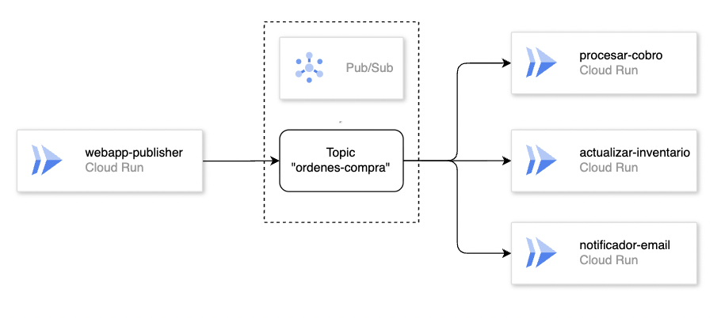

# MOD3-LAB3: Arquitectura Orientada a Eventos en GCP
**Instructor:** Miguel Leyva

---

## 1. Objetivo y Alcance

**Objetivo**
* Implementar una arquitectura desacoplada completa (End-to-End) en Google Cloud Platform.
* Aprender a desplegar infraestructura mediante línea de comandos (`gcloud` CLI) en Cloud Shell.
* Comprender y solucionar desafíos de seguridad e identidad (IAM) en arquitecturas modernas.

**Qué aprenderá el alumno**
* Desplegar un **Frontend Web** interactivo en contenedores usando **Cloud Run**.
* Configurar un bus de eventos robusto usando **Cloud Pub/Sub**.
* Escribir y desplegar múltiples **Microservicios (Cloud Functions 2nd Gen)** trabajando en paralelo mediante el patrón Fan-Out.

### 2. Prerrequisitos y herramientas
* Una cuenta activa de Google Cloud Platform (GCP).
* Un proyecto de GCP creado y seleccionado con facturación (Billing) habilitada.
* Permisos de rol de Propietario (Owner) o Editor sobre el proyecto para habilitar APIs y crear recursos.
* Navegador web actualizado (se recomienda Google Chrome).
* Conocimientos básicos de lectura de código en JavaScript y uso de la terminal de comandos.

---

## 3. El problema

En "ShopUTEC", cuando un cliente compra, el sistema web intenta cobrar y enviar un correo en la misma secuencia. Si el servidor de correos falla, la transacción colapsa, la pantalla del usuario muestra un error (Timeout) y se pierden ventas.


## 4. La Solución
La web (Cloud Run) actuará solo como **Publicador**, enviando un mensaje de "Nueva Orden" al bus de eventos (Pub/Sub) y respondiendo inmediatamente al usuario con un mensaje de éxito. Dos microservicios independientes (Cloud Functions) actuarán como **Consumidores**, escuchando el bus y procesando el cobro y el correo en segundo plano de forma segura.



---

## 5. Laboratorio guiado

### FASE 1: Preparar el ambiente

1. Ingrese a la consola de Google Cloud: https://console.cloud.google.com/
2. Asegúrese de tener un proyecto seleccionado.
3. Haga clic en el ícono de **Activar Cloud Shell** (`>_`) en la esquina superior derecha.
4. Luego clic en **Autorizar**
5. En la terminal que aparece en la parte inferior, ejecute el siguiente comando para habilitar todas las herramientas necesarias:

```bash
gcloud services enable \
  cloudresourcemanager.googleapis.com \
  pubsub.googleapis.com \
  cloudfunctions.googleapis.com \
  eventarc.googleapis.com \
  run.googleapis.com \
  artifactregistry.googleapis.com \
  cloudbuild.googleapis.com
```
6. Asignar el rol de Cloud Build Builder a la cuenta de Servicio de Compute

```bash
PROJECT_ID=$(gcloud config get-value project)

PROJECT_NUMBER=$(gcloud projects describe $PROJECT_ID --format='value(projectNumber)')

gcloud projects add-iam-policy-binding $PROJECT_ID \
    --member=serviceAccount:$PROJECT_NUMBER-compute@developer.gserviceaccount.com \
    --role=roles/cloudbuild.builds.builder
```

### FASE 2: Crear el Bus de Eventos
Cree el tópico de Pub/Sub donde llegarán los mensajes de las nuevas compras:

```bash
gcloud pubsub topics create ordenes-compra
```

### FASE 3: Desplegar Cloud Run Function "Procesar Cobro"

1. En la terminal copiamos el siguiente comando:
```bash
mkdir ~/procesar-cobro && cd ~/procesar-cobro
```
2. Clic en **Abrir editor** y luego se abrira la interfaz de VSCode
3. Dentro del folder "procesar-cobro", crear el archivo index.js
4. Pegar el siguiente código en el archivo creado:
```javascript
const functions = require('@google-cloud/functions-framework');
functions.cloudEvent('helloPubSub', (cloudEvent) => {
  const data = Buffer.from(cloudEvent.data.message.data, 'base64').toString();
  const orden = JSON.parse(data);
  console.log(`[CORE] Pago de $${orden.total} procesado con éxito para la orden ${orden.id_orden}. Cliente: ${orden.cliente}`);
});
```
5. Crear el archivo package.json a la altura del archivo index.js y pegar el siguiente código:
```javascript
{
  "name": "core",
  "main": "index.js",
  "dependencies": {
    "@google-cloud/functions-framework": "^3.0.0"
  }
}
```
6. Luego de guardar los archivos, clic en "Abrir Terminal"
7. Ejecutar el siguiente comando para desplegar la función:
```bash
gcloud functions deploy procesar-cobro --gen2 --runtime=nodejs22 --region=us-central1 --source=. --entry-point=helloPubSub --trigger-topic=ordenes-compra
```
8. Luego confirmar con la tecla "y"

### FASE 4: Desplegar Cloud Run Function "Notificador Email"

1. En la terminal copiamos el siguiente comando:
```bash
mkdir ~/notificador-email && cd ~/notificador-email
```
2. Clic en **Abrir editor** y luego se abrira la interfaz de VSCode
3. Dentro del folder "notificador-email", crear el archivo index.js
4. Pegar el siguiente código en el archivo creado:
```javascript
const functions = require('@google-cloud/functions-framework');
functions.cloudEvent('helloPubSub', (cloudEvent) => {
  const data = Buffer.from(cloudEvent.data.message.data, 'base64').toString();
  const orden = JSON.parse(data);
  console.log(`[EMAIL] Conectando al servidor SMTP... Correo de confirmación enviado a: ${orden.email}`);
});
```
5. Crear el archivo package.json a la altura del archivo index.js y pegar el siguiente código:
```javascript
{
  "name": "email",
  "main": "index.js",
  "dependencies": {
    "@google-cloud/functions-framework": "^3.0.0"
  }
}
```
6. Luego de guardar los archivos, clic en "Abrir Terminal"
7. Ejecutar el siguiente comando para desplegar la función:
```bash
gcloud functions deploy notificador-email --gen2 --runtime=nodejs22 --region=us-central1 --source=. --entry-point=helloPubSub --trigger-topic=ordenes-compra
```
8. Luego confirmar con la tecla "y"

### FASE 5: Desplegar Cloud Run Function "WebApp Publisher"

1. En la terminal copiamos el siguiente comando:
```bash
mkdir ~/webapp-publisher && cd ~/webapp-publisher
```
2. Clic en **Abrir editor** y luego se abrira la interfaz de VSCode
3. Dentro del folder "notificador-email", crear el archivo index.js
4. Pegar el siguiente código en el archivo creado:
```javascript
const express = require('express');
const { PubSub } = require('@google-cloud/pubsub');

const app = express();
const pubsub = new PubSub();
app.use(express.urlencoded({ extended: true }));

app.get('/', (req, res) => {
  res.send(`
    <html>
      <body style="font-family: Arial; padding: 50px; background: #f0f2f5;">
        <div style="background: white; padding: 30px; border-radius: 10px; max-width: 400px; margin: auto; box-shadow: 0 4px 8px rgba(0,0,0,0.1);">
          <h2 style="color: #333;">🛒 ShopUTEC Checkout</h2>
          <form action="/comprar" method="POST">
            <input type="hidden" name="id_orden" value="ORD-${Math.floor(Math.random()*10000)}">
            <label>Nombre del Cliente:</label><br>
            <input type="text" name="cliente" style="width:100%; padding:8px; margin: 8px 0;" required><br>
            <label>Correo Electrónico:</label><br>
            <input type="email" name="email" style="width:100%; padding:8px; margin: 8px 0;" required><br>
            <label>Monto a Pagar ($):</label><br>
            <input type="number" name="total" value="1500" style="width:100%; padding:8px; margin: 8px 0;"><br><br>
            <button type="submit" style="width:100%; padding:12px; background:#0056b3; color:white; border:none; border-radius:4px; font-weight:bold; cursor:pointer;">Confirmar Compra</button>
          </form>
        </div>
      </body>
    </html>
  `);
});

app.post('/comprar', async (req, res) => {
  try {
    const data = Buffer.from(JSON.stringify(req.body));
    await pubsub.topic('ordenes-compra').publishMessage({ data });
    res.send(`
      <div style="font-family: Arial; text-align: center; padding: 50px;">
        <h1 style="color: #28a745;">✅ ¡Compra Exitosa!</h1>
        <p>Tu orden <b>${req.body.id_orden}</b> ha sido recibida y está siendo procesada.</p>
        <a href="/" style="text-decoration: none; color: #0056b3;">← Realizar otra compra</a>
      </div>
    `);
  } catch (error) {
    res.status(500).send(`Error publicando el mensaje: ${error.message}`);
  }
});

app.listen(8080, () => console.log('Servidor web iniciado'));
```
5. Crear el archivo package.json a la altura del archivo index.js y pegar el siguiente código:
```javascript
{
  "name": "webapp",
  "main": "index.js",
  "dependencies": {
    "express": "^4.18.2",
    "@google-cloud/pubsub": "^4.0.0"
  }
}
```
6. Luego de guardar los archivos, clic en "Abrir Terminal"
7. Ejecutar el siguiente comando para desplegar la función:
```bash
gcloud run deploy webapp-publisher --source=. --region=us-central1 --allow-unauthenticated --quiet
```
8. Luego confirmar con la tecla "y"

### FASE 6: Seguridad y Permisos (IAM)

Por defecto, Cloud Run no tiene permisos para escribir en Pub/Sub. Debemos otorgarle a la "Cuenta de Servicio" (identidad robótica del contenedor) el rol de publicador para evitar errores de acceso (`PERMISSION_DENIED`).

1. Ejecute este bloque de comandos para otorgar el acceso necesario:
```bash
PROJECT_ID=$(gcloud config get-value project)
PROJECT_NUMBER=$(gcloud projects describe $PROJECT_ID --format="value(projectNumber)")

gcloud projects add-iam-policy-binding $PROJECT_ID \
  --member="serviceAccount:${PROJECT_NUMBER}-compute@developer.gserviceaccount.com" \
  --role="roles/pubsub.publisher"
```
*(Espere aproximadamente 30 segundos tras ejecutar este comando para que los permisos se propaguen en la nube).*

---

## 6. Pruebas y validación

El sistema ya está completamente operativo. Para probarlo:

**1. Usar el Frontend:**
* En su terminal, busque la URL que generó Cloud Run (se parece a `https://webapp-publisher-xxxxx-uc.a.run.app`).
* Haga clic en ella para abrirla en su navegador.
* Llene el formulario de compra con datos de prueba y haga clic en **Confirmar Compra**. Debería ver la pantalla verde de éxito de forma inmediata.

**2. Validar el Backend (Logs):**
* Vaya a la consola gráfica de GCP y busque el servicio **Cloud Run**.
* Haga clic en `procesar-cobro` y luego en la pestaña **Registros** (Logs). Verá que la orden fue cobrada.
* Regrese, haga clic en `notificador-email` y revise sus **Registros**. Verá que el correo fue enviado en paralelo y exactamente al mismo tiempo.

**¡Felicidades!** Ha construido un sistema asíncrono, tolerante a fallos y altamente escalable.

---

## 7. Laboratorio propuesto

Finalice con el ultimo subscriber "Gestor Inventario":

**Instrucciones del Reto:**
1. Abra su terminal de Cloud Shell y cree un nuevo directorio llamado `gestor-inventario`:
   `mkdir ~/gestor-inventario && cd ~/gestor-inventario`
2. Utilizando el editor de Cloud Shell, cree los archivos `index.js` y `package.json` de manera similar a como lo hizo en las Fases 3 y 4.
3. En el archivo `index.js`, modifique la lógica de la función para que imprima en consola un mensaje de logística, por ejemplo:
   `console.log('[INVENTARIO] Separando stock en almacén para la orden: ' + orden.id_orden);`
4. Desde la terminal, despliegue la nueva Cloud Function con el nombre `gestor-inventario`. 
   * **Pista clave:** Asegúrese de conectarla exactamente al mismo tópico utilizado anteriormente usando el parámetro `--trigger-topic=ordenes-compra`.
5. **Validación Final:** Vaya a la URL de su WebApp (Frontend), realice una nueva compra y diríjase a los registros (Logs) en la consola de GCP. Confirme que ahora las **tres funciones** (`procesar-cobro`, `notificador-email` y `gestor-inventario`) se dispararon simultáneamente en paralelo procesando la misma orden.

*(Nota: Al finalizar el laboratorio propuesto, recuerde agregar el comando `gcloud functions delete gestor-inventario --gen2 --region=us-central1 --quiet` a su lista de limpieza en la Sección 8).*

---

## 8. Limpieza de Recursos

Para evitar cargos continuos en su facturación, elimine los recursos creados ejecutando estos comandos:

```bash
gcloud functions delete procesar-cobro --gen2 --region=us-central1 --quiet
gcloud functions delete notificador-email --gen2 --region=us-central1 --quiet
gcloud run services delete webapp-publisher --region=us-central1 --quiet
gcloud functions delete gestor-inventario --region=us-central1 --quiet
gcloud pubsub topics delete ordenes-compra --quiet
```