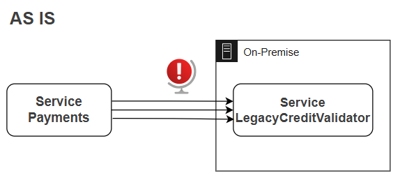
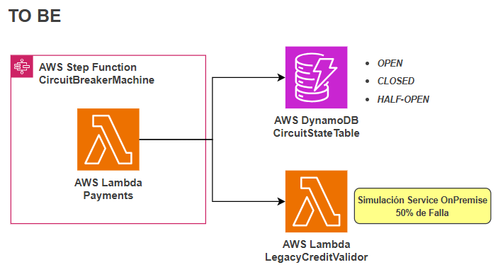
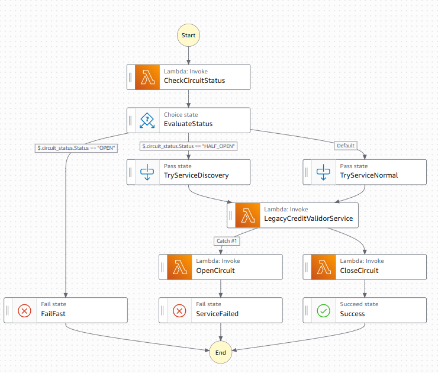
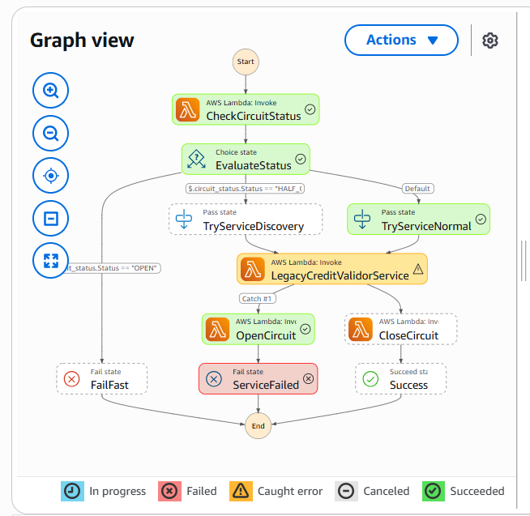
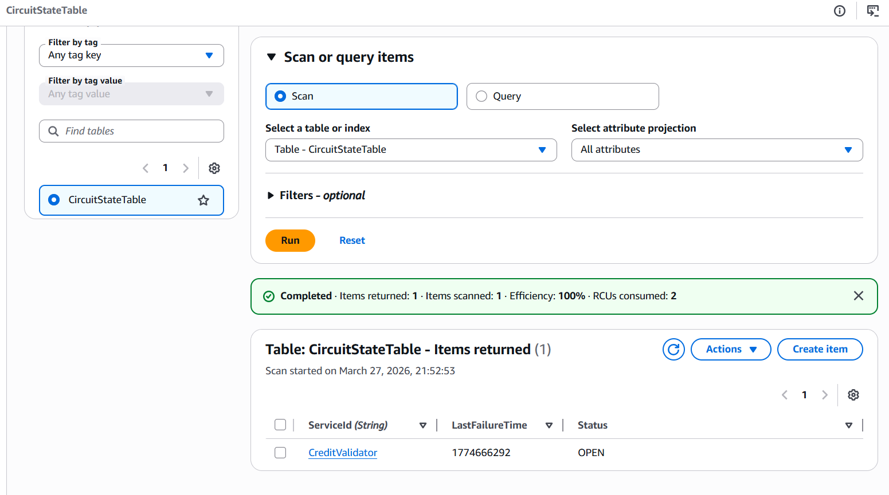
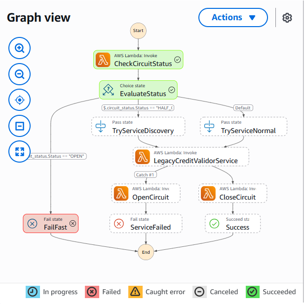
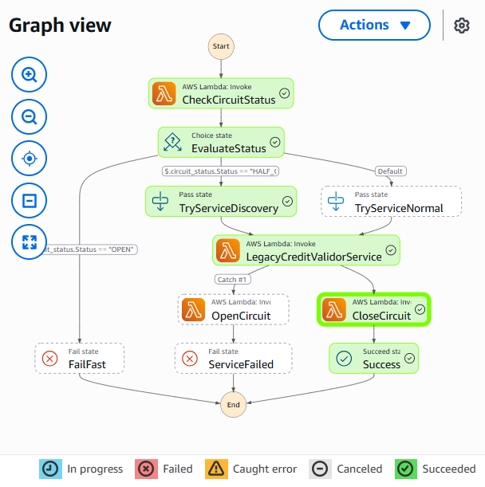

# MOD3-LAB4: Implementación de Patrón Circuit Breaker en AWS
**Instructor:** Miguel Leyva

---

## 1. Objetivo, alcance

**Objetivo**
* Implementar un patrón de arquitectura Circuit Breaker utilizando servicios Serverless de AWS.
* El sistema será capaz de detectar fallos en un servicio legado, interrumpir el tráfico para evitar saturación y auto-recuperarse probando la conexión después de un tiempo prudencial.

**Qué aprenderá el alumno**
* Modelar máquinas de estado complejas con lógica de negocio en AWS Step Functions.
* Implementar lógica de estados distribuidos (OPEN, CLOSED, HALF-OPEN) usando DynamoDB y Lambda.
* Simular fallos y recuperaciones automáticas en sistemas distribuidos.

---

## 2. Prerrequisitos y herramientas
* Tener activa una cuenta de AWS.
* Contar con los permisos para gestionar Lambdas, Step Function, DynamoDB
* Usar la región `us-east-1` (Virginia).
* Conocimientos: Lectura básica de JSON y Python.
* Tener instalado Visual Studio Code y DrawIO.

---

## 3. El problema

Eres el Arquitecto de Soluciones en una Fintech en crecimiento.
El núcleo del negocio depende de un servicio antiguo de validación de crédito (LegacyCreditValidator) alojado en un mainframe on-premise. Este servicio legado es inestable. Cuando falla, tu nueva aplicación web moderna sigue enviándole miles de solicitudes por segundo.
* Esto provoca que:
  * El servicio legado se sature más y tarde más en recuperarse.
  * La aplicación moderna se queda "colgada" esperando respuestas, consumiendo memoria y dinero en AWS innecesariamente.



## 4. La Solución
* Implementar un Circuit Breaker.
* Si el servicio falla, "abrimos el circuito" y rechazamos las peticiones inmediatamente (ahorrando tiempo y dinero).
* Después de 30 segundos, el sistema entra en modo "Half-Open" y deja pasar una sola petición de prueba.
* Si la prueba funciona, el sistema se auto-recupera y cierra el circuito.



**Decisiones Clave** 
* Utilizaremos una arquitectura 100% Serverless para minimizar la carga operativa.
* **Amazon DynamoDB (CircuitStateTable):** Actúa como la memoria persistente del sistema. Guarda el estado actual (CLOSED, OPEN, HALF_OPEN) y la hora del último fallo.  Por qué: Latencia de milisegundos y consistencia fuerte necesaria para bloquear tráfico rápido.
* **AWS Lambda (Payments):** Contiene la lógica del patrón. Lee la base de datos y decide si dejamos pasar tráfico o si intentamos una recuperación. 
* **AWS Lambda (LegacyCreditValidor):** Simula el servicio legado. Tiene un código diseñado para fallar aleatoriamente o bajo demanda.
* **AWS Step Functions (CircuitBreakerMachine):** El orquestador. Coordina los pasos visualmente: verifica estado -> toma decisión -> intenta ejecutar -> maneja errores -> actualiza estado.

---

## 5. Laboratorio guiado

### FASE 1: Crear la Persistencia (DynamoDB)
1. En la barra de búsqueda superior, escribe DynamoDB.
2. En el menú izquierdo, clic en Tables.
3. Clic en el botón naranja Create table.
4. Table details:
   * Table name: `CircuitStateTable`
   * Partition key: `ServiceId` (Tipo: String).
5. En Table settings, dejar seleccionado Default settings. 
6. Clic en Create table. 
7. Esperar a que el estado diga "Active". 
8. Clic en el nombre de la tabla `CircuitStateTable` (hipervínculo azul). 
9. Arriba a la derecha, clic en el botón Explore table items. 
10. Clic en Create item. 
11. En el campo Value para ServiceId, escribir: `CreditValidator` 
12. Clic en el botón Add new attribute -> seleccionar String. 
13. En Attribute name escribir: `Status` 
14. En Value escribir: `CLOSED` 
15. Clic en Create item. 

> **Explicación:** Hemos inicializado el circuito en estado "Cerrado" (funcionando correctamente). 

### FASE 2: Configurar Seguridad (IAM) 
1. Buscar el servicio IAM. 
2. Clic en Roles. 
3. Clic en Create role. 
4. En Trusted entity type, dejar AWS service. 
5. En Service or use case, seleccionar Lambda. 
6. Clic en Next. 
7. En Add permissions, usar la barra de búsqueda para encontrar y marcar (checkbox) estas dos políticas: 
   * `AWSLambdaBasicExecutionRole` (Para escribir logs en CloudWatch). 
   * `AmazonDynamoDBFullAccess` (Para leer y escribir en la tabla). 
   > *Nota: En un entorno real restringiríamos el acceso solo a nuestra tabla específica.* 
8. Clic en Next. 
9. En Role name, escribir: `LabCircuitBreakerRole` 
10. Clic en Create role. 

### FASE 3: Crear el Servicio Inestable (Lambda 1) 
1. Buscar el servicio Lambda. 
2. Clic en el botón naranja Create function. 
3. Seleccionar Author from scratch. 
4. Function name: `LegacyCreditValidor` 
5. Runtime: Seleccionar Python 3.14+. 
6. Desplegar la flecha Change default execution role. 
7. Seleccionar Use an existing role. 
8. En el desplegable, elegir: `LabCircuitBreakerRole`. 
9. Clic en Create function. 
10. Bajar a la pestaña Code. Borrar el código de ejemplo y pegar el siguiente código: 

```python
import json
import random

def lambda_handler(event, context):
    # Opcional: force_fail=True hace que falle siempre.
    force_fail = event.get('force_fail', False)
    
    # Opcional: force_success=True hace que SIEMPRE funcione (evita el random).
    force_success = event.get('force_success', False)
    
    # 1. Prioridad maxima: Si el usuario pide exito, retornamos exito sin azar.
    if force_success:
        return {
            'statusCode': 200,
            'body': json.dumps('Exito FORZADO! Servicio operativo.')
        }

    # 2. Si no es exito forzado, evaluamos fallo forzado O azar (50%)
    if force_fail or random.random() < 0.5:
        raise Exception("ServiceUnavailable: El servicio legado ha fallado inesperadamente.")
    
    return {
        'statusCode': 200,
        'body': json.dumps('Exito! Tarjeta Validada y procesada.')
    }
```

11. Clic en Deploy. 

### FASE 4: Crear el Gestor del Circuito (Lambda 2) 
1. Volver a la lista de funciones (clic en "Functions"). 
2. Clic en Create function. 
3. Function name: `Payments` 
4. Runtime: Python 3.14+ 
5. Change default execution role -> Use an existing role -> `LabCircuitBreakerRole`. 
6. Clic en Create function. 
7. En el editor de código, pegar el código del archivo `MOD3-LAB4-Payments.py` 

```python
import json
import boto3
import time
from botocore.exceptions import ClientError

dynamodb = boto3.resource('dynamodb')
table = dynamodb.Table('CircuitStateTable')

# Configuracion
SERVICE_ID = 'CreditValidator'
RESET_TIMEOUT = 50  # Segundos que el circuito espera antes de intentar recuperarse

def lambda_handler(event, context):
    action = event.get('action') 
    
    # ACCION 1: CONSULTAR ESTADO
    if action == 'GET':
        response = table.get_item(Key={'ServiceId': SERVICE_ID})
        item = response.get('Item', {'Status': 'CLOSED'})
        status = item['Status']
        
        # Logica HALF_OPEN: Si esta OPEN, verificamos cuanto tiempo ha pasado
        if status == 'OPEN':
            last_failure = int(item.get('LastFailureTime', 0))
            current_time = int(time.time())
            
            # Si paso el tiempo de espera, cambiamos a HALF_OPEN atomicamente
            if (current_time - last_failure) > RESET_TIMEOUT:
                table.update_item(
                    Key={'ServiceId': SERVICE_ID},
                    UpdateExpression="set #s = :s",
                    ExpressionAttributeNames={'#s': 'Status'},
                    ExpressionAttributeValues={':s': 'HALF_OPEN'}
                )
                print("Timeout superado. Cambiando a HALF_OPEN para prueba.")
                return {'Status': 'HALF_OPEN'}
        
        return {'Status': status}

    # ACCION 2: ABRIR CIRCUITO (FALLO DETECTADO)
    elif action == 'SET_OPEN':
        current_time = int(time.time())
        print(f"Abriendo circuito a las {current_time}")
        table.update_item(
            Key={'ServiceId': SERVICE_ID},
            UpdateExpression="set #s = :s, LastFailureTime = :t",
            ExpressionAttributeNames={'#s': 'Status'},
            ExpressionAttributeValues={
                ':s': 'OPEN',
                ':t': current_time
            }
        )
        return {'Status': 'OPEN'}

    # ACCION 3: CERRAR CIRCUITO (RECUPERACION EXITOSA)
    elif action == 'SET_CLOSED':
        print("Servicio recuperado. Cerrando circuito.")
        table.update_item(
            Key={'ServiceId': SERVICE_ID},
            UpdateExpression="set #s = :s",
            ExpressionAttributeNames={'#s': 'Status'},
            ExpressionAttributeValues={':s': 'CLOSED'}
        )
        return {'Status': 'CLOSED'}
    
    return {'error': 'Invalid Action'}
```

8. Clic en Deploy. 

### FASE 5: El Orquestador (Step Functions) 
1. Buscar el servicio Step Functions. 
2. Clic en el menú izquierdo State machines. 
3. Clic en Create state machine. 
4. Seleccionar la plantilla Blank. Clic en Select. 
5. En el cuadro de diálogo: 
   * State machine name: `CircuitBreakerMachine`
6. Clic en el boton Continue.
7. Estás en el "Workflow Studio".  Arriba a la derecha, cambia la vista de "Design" a "Code". 
7. Borra el JSON existente y pega el siguiente código:
```json
{
  "Comment": "Circuit Breaker Pattern",
  "StartAt": "CheckCircuitStatus",
  "States": {
    "CheckCircuitStatus": {
      "Type": "Task",
      "Resource": "arn:aws:lambda:us-east-1:TU_CUENTA:function:Payments",
      "Parameters": {
        "action": "GET"
      },
      "Next": "EvaluateStatus",
      "ResultPath": "$.circuit_status"
    },
    "EvaluateStatus": {
      "Type": "Choice",
      "Choices": [
        {
          "Variable": "$.circuit_status.Status",
          "StringEquals": "OPEN",
          "Next": "FailFast"
        },
        {
          "Variable": "$.circuit_status.Status",
          "StringEquals": "HALF_OPEN",
          "Next": "TryServiceDiscovery"
        }
      ],
      "Default": "TryServiceNormal"
    },
    "FailFast": {
      "Type": "Fail",
      "Error": "CircuitOpenError",
      "Cause": "Circuito ABIERTO. Solicitud rechazada para proteger el sistema."
    },
    "TryServiceDiscovery": {
      "Comment": "Estado HALF_OPEN: Probamos si el servicio ya funciona",
      "Type": "Pass",
      "Next": "LegacyCreditValidorService"
    },
    "TryServiceNormal": {
      "Comment": "Estado CLOSED: Flujo normal",
      "Type": "Pass",
      "Next": "LegacyCreditValidorService"
    },
    "LegacyCreditValidorService": {
      "Type": "Task",
      "Resource": "arn:aws:lambda:us-east-1:TU_CUENTA:function:LegacyCreditValidor",
      "ResultPath": "$.service_result",
      "Next": "CloseCircuit",
      "Catch": [
        {
          "ErrorEquals": [
            "States.ALL"
          ],
          "Next": "OpenCircuit"
        }
      ]
    },
    "OpenCircuit": {
      "Type": "Task",
      "Resource": "arn:aws:lambda:us-east-1:TU_CUENTA:function:Payments",
      "Parameters": {
        "action": "SET_OPEN"
      },
      "Next": "ServiceFailed"
    },
    "CloseCircuit": {
      "Type": "Task",
      "Resource": "arn:aws:lambda:us-east-1:TU_CUENTA:function:Payments",
      "Parameters": {
        "action": "SET_CLOSED"
      },
      "Next": "Success"
    },
    "ServiceFailed": {
      "Type": "Fail",
      "Error": "ServiceError",
      "Cause": "El servicio fallo. Circuito actualizado a OPEN."
    },
    "Success": {
      "Type": "Succeed"
    }
  }
}
```
8. Debes reemplazar TU_CUENTA por tu ID de cuenta AWS (lo ves en la esquina superior derecha, es un número de 12 dígitos). 
9. Clic en el botón naranja Create, luego clic en el botón Confirm.
10. El flujo debería quedar de la siguiente manera:



---

## 6. Pruebas y validación 
Vamos a realizar las pruebas usando los nuevos controles forzados que hemos creado. 

**Prueba A: Forzar el fallo** 
1. En la pantalla de tu Step Function, clic en Execute -> Start execution.
2. En el campo Input, usar: `{ "force_fail": true }` 
3. Clic en Start execution. 
* **Resultado:** El sistema falla sí o sí.  El circuito se abre ("OPEN"). Validar Tabla DynamoDB que el estado se actualizó a Open.





**Prueba B: Verificar "Fail Fast"** 
1. Inmediatamente después (antes de 50s). 
2. Input: `{ "force_success": true }` (Intentamos forzar éxito, pero el circuito manda). 
* **Resultado:** FailFast.  Aunque pidas éxito, el paso EvaluateStatus te bloquea antes de llegar al servicio. El circuito funciona. 



**Prueba C: Recuperación Controlada**
1. Espera 50 segundos. 
2. Clic en Start execution.
3. Input: `{ "force_success": true }` 
* **Resultado:**
  * CheckCircuitStatus: Devuelve HALF_OPEN.
  * EvaluateStatus: Pasa a prueba.
  * CallUnreliableService: ÉXITO GARANTIZADO.  Ya no dependemos de la moneda al aire.
  * CloseCircuit: Se cierra el circuito.
  * Success: Todo verde.

  

---

## 7. Laboratorio propuesto

Modificar el código del servicio para simular un entorno realmente hostil, donde no tienes control sobre cuándo falla, pero sabes que falla muy a menudo. 

**Instrucciones:** 
1. Edita la función Lambda `LegacyCreditValidor`. 
2. Elimina o comenta la lógica que lee `force_fail` y `force_success`. Ya no tendrás el control manual.
3. Aumenta la probabilidad de fallo aleatorio del 50% (0.5) al 70% (0.7).

**Objetivo:** Ejecuta la Step Function múltiples veces seguidas (al menos 10 veces). Debes observar cómo el circuito se abre "naturalmente" debido a la alta tasa de fallos, y cómo se recupera eventualmente.

**Pistas:** 
* Busca la línea `if random.random() < 0.5:` y cambia el valor. 
* Asegúrate de que el código solo dependa del azar: `if random.random() < 0.7: raise Exception...` 

---

## 8. Limpieza de recursos
AWS cobra por almacenamiento y ejecución. Aunque este laboratorio entra en la capa gratuita, siempre eliminar tus recursos para evitar sorpresas o consumo de créditos.

* **DynamoDB:** Ir a Tables -> Seleccionar `CircuitStateTable` -> Clic Delete -> Escribir "delete" -> Confirmar. 
* **Step Functions:** Seleccionar `CircuitBreakerMachine` -> Clic Delete -> Confirmar. 
* **Lambda:** Ir a Functions -> Seleccionar `LegacyCreditValidor` -> Delete.  Repetir con `Payments`. 
* **IAM:** Ir a Roles -> Buscar `LabCircuitBreakerRole` -> Delete.  Buscar también el rol creado por Step Functions (ej: `StepFunctions-CircuitBreakerMachine-role...`) y borrarlo. 